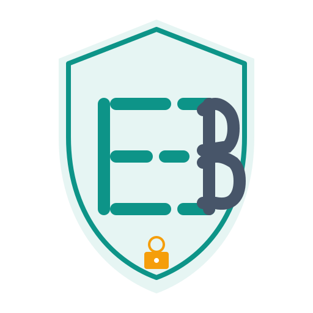

# CellBlock Brand Assets

This directory contains all brand assets for the CellBlock project.

## Logo Files

### Primary Logo
- **logo.svg** - Scalable vector logo (512x512 base)
  - Shield shape with cell bars
  - Bars form "CB" monogram
  - Teal (#0D9488) and Slate (#475569) colors
  - Lock accent (#F59E0B)

### Logo Concept
The logo combines several symbolic elements:
- **Shield**: Protection and security
- **Cell Bars**: Structure and boundaries (prison metaphor)
- **CB Monogram**: Cell bars subtly form "C" and "B" letters
- **Lock**: Enforcement and accountability

### Usage

**For Web:**
```html

```

**For Mobile Apps:**
- iOS: Use Xcode to generate app icons from logo.svg
- Windows: Convert to .ico format (256x256, 48x48, 32x32, 16x16)
- Android: Use Android Studio to generate adaptive icon

**For Documentation:**
```markdown

```

## Color Palette

### Primary Colors
- **Teal**: #0D9488 (Trust, calm, digital wellness)
- **Slate**: #475569 (Professional, neutral)

### Accent Colors
- **Amber**: #F59E0B (Warnings, attention)
- **Emerald**: #10B981 (Success, available time)
- **Rose**: #F43F5E (Danger, lockdown)

### Neutral Colors
- **Zinc 50**: #FAFAFA (Light background)
- **Zinc 900**: #18181B (Dark background)
- **Zinc 100**: #F4F4F5 (Light text)
- **Zinc 800**: #27272A (Dark text)

## Typography

- **Sans-serif**: Inter
- **Monospace**: JetBrains Mono

## Icon Generation

### Generate PNG from SVG

```bash
# Install imagemagick
sudo apt-get install imagemagick

# Generate various sizes
convert -background none logo.svg -resize 512x512 logo-512.png
convert -background none logo.svg -resize 256x256 logo-256.png
convert -background none logo.svg -resize 128x128 logo-128.png
convert -background none logo.svg -resize 64x64 logo-64.png
convert -background none logo.svg -resize 32x32 logo-32.png
convert -background none logo.svg -resize 16x16 logo-16.png
```

### Generate Favicon

```bash
# Create favicon.ico with multiple sizes
convert logo.svg -define icon:auto-resize=256,128,64,48,32,16 ../srv-front/public/favicon.ico
```

### Generate App Icons for iOS

```bash
# iOS requires specific sizes
for size in 20 29 40 60 76 83.5 120 152 167 180 1024; do
  convert -background none logo.svg -resize ${size}x${size} ios-icon-${size}.png
done
```

### Generate Windows Icon

```bash
# Windows .ico file
convert logo.svg -define icon:auto-resize=256,128,96,64,48,32,16 ../windows/CellBlock.UI/Resources/icon.ico
```

## License

All brand assets are part of the CellBlock project and are licensed under MIT License.

## Attribution

Logo designed and created by Claude Code (AI-powered development by Anthropic) for the CellBlock project.
