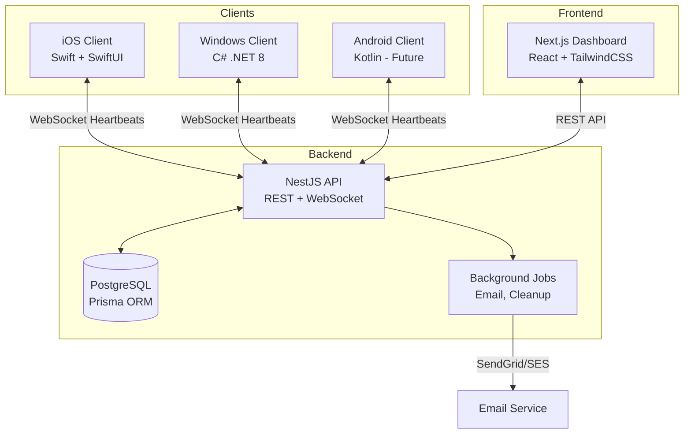
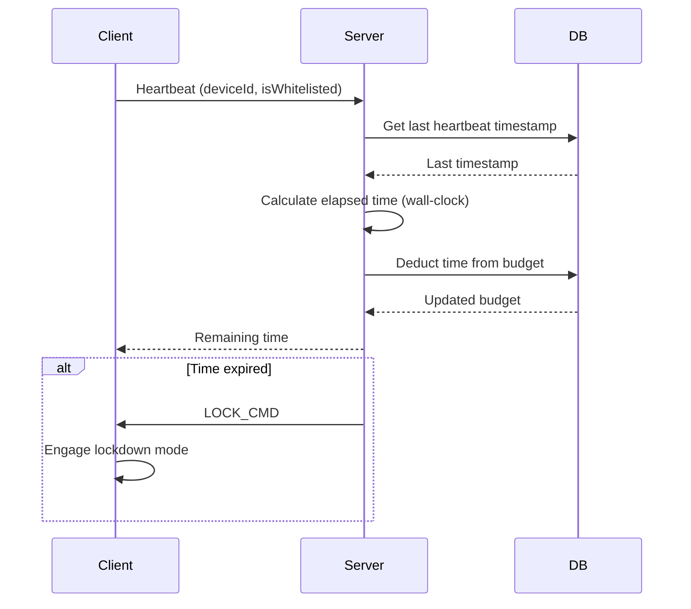
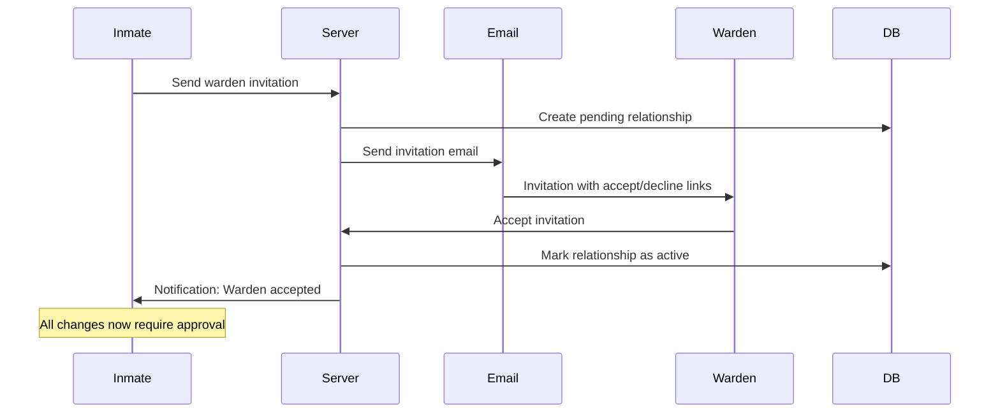
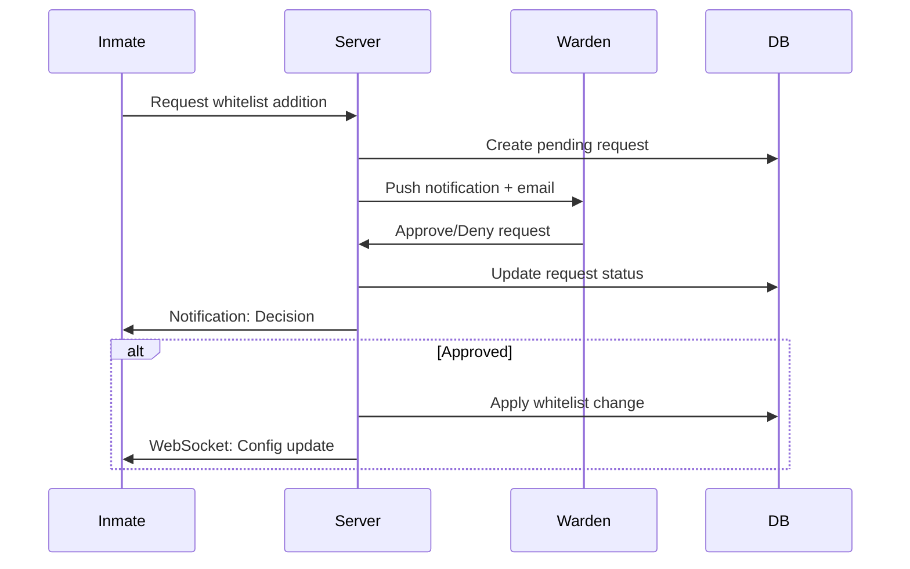

# Architecture

CellBlock follows a hub-and-spoke architecture where the backend server is the source of truth for time budgets and enforcement rules.

## System Overview

## Core Principles

### Hub-and-Spoke Model

The backend server is the authoritative source of truth for:

- Time budgets and remaining time
- Whitelist configurations
- Warden relationships and approvals
- Usage history

Clients are "spokes" that:

- Send heartbeats to report usage
- Receive commands to lock/unlock
- Enforce local blocking based on server rules
- Cache minimal state for offline resilience

### Server Time Authority

- **Server time (UTC) is authoritative** - Client timestamps ignored to prevent clock manipulation
- Time budget calculations always use server-side time
- Daily resets calculated in user's configured timezone on server

### Offline Behavior

- **Clients do NOT track time offline** - Time only deducted when server receives heartbeats
- **Blocking rules persist locally** - Cached whitelist continues to work offline
- **Fail-safe mode** - If server unreachable for extended period, clients default to OPEN

## Component Architecture

### Backend (NestJS)

#### Modules

- **Auth Module** - JWT authentication, Google OAuth, email verification
- **User Module** - User profiles, preferences, timezone management
- **Time Budget Module** - Time tracking, daily/weekly limits, budget calculations
- **Whitelist Module** - Whitelist CRUD, category management
- **Warden Module** - Invitations, approvals, parole, lockdowns
- **Device Module** - Device registration, fingerprinting, activity tracking
- **WebSocket Gateway** - Real-time heartbeat handling, push notifications
- **Notification Module** - Email sending, push notification delivery
- **Analytics Module** - Usage reports, trend calculations

#### Database Schema

See [DBSCHEMA.md](https://github.com/dirkpetersen/cellblock/blob/main/DBSCHEMA.md) for complete schema.

Key tables:

- `users` - User accounts
- `devices` - Registered devices
- `time_budgets` - Daily and weekly limits
- `usage_logs` - Heartbeat history
- `whitelist_items` - Allowed apps/domains
- `warden_relationships` - Warden-inmate pairs
- `requests` - Pending approvals
- `parole_grants` - Emergency time history

#### API Versioning

- URL-based: `/api/v1/...`
- Backward compatibility for 6 months after new version
- Client version check enforced

### Frontend (Next.js)

#### Pages

- `/` - Landing page
- `/login` - Authentication
- `/signup` - Registration
- `/dashboard` - Inmate dashboard (time remaining, usage charts)
- `/settings` - Profile, time budget, whitelist, wardens
- `/warden` - Warden dashboard (inmates, pending requests)
- `/warden/[inmateId]` - Inmate detail view

#### State Management

- **TanStack Query** - Server state (API data, caching, refetching)
- **Zustand** - Client state (UI state, user preferences)
- **React Context** - Auth state

#### Real-time Updates

- WebSocket connection for live time remaining updates
- Optimistic updates for better UX
- Automatic refetch on window focus

### iOS Client (Swift)

#### Architecture

- **SwiftUI** - Declarative UI
- **Combine** - Reactive programming
- **Screen Time API** - App and website blocking (Phase 1)
- **Family Controls** - Advanced enforcement (Phase 2)

#### Components

- **Main App** - Dashboard, settings, status display
- **WebSocket Manager** - Heartbeat sender, command receiver
- **Device Activity Extension** - Background monitoring
- **Local Storage** - Keychain for tokens, UserDefaults for cache

#### Blocking Strategy

**Phase 1 (MVP):**

- Block "Social" category using Screen Time API
- No entitlement required
- User can bypass in iOS Settings

**Phase 2 (Post-MVP):**

- Block all apps except whitelist
- Persistent shields via DeviceActivityMonitorExtension
- Requires Apple entitlement approval

### Windows Client (C# .NET 8)

#### Architecture

- **WPF/WinUI** - Desktop UI framework
- **Windows Service** - Background enforcement (runs as SYSTEM)
- **Named Pipes** - IPC between UI and service

#### Components

- **UI Application**
  - System tray icon with time display
  - Settings panel
  - Status dashboard
  - Auto-start on boot

- **Background Service**
  - Network filtering
  - WebSocket client
  - Heartbeat sender
  - Tamper detection

#### Blocking Strategy

**MVP:**

- Modified hosts file (redirect blocked domains to 127.0.0.1)
- Simple but easily bypassed

**Production:**

- Windows Filtering Platform (WFP) driver
- Kernel-level packet filtering
- More robust, harder to bypass

## Time Tracking System

### Heartbeat Flow

### Time Calculation

**Wall-Clock Time:**

- Only elapsed real-world time counts
- Multiple devices active simultaneously = 1 minute per wall-clock minute

**Simultaneous Device Detection:**

- Devices sending heartbeats within 45 seconds = simultaneous
- Example:
  - Device A: 2:00:00 PM
  - Device B: 2:00:30 PM (within 45s)
  - Only 1 minute deducted from 2:00-2:01

### Daily Reset

- Occurs at midnight in user's configured timezone
- Server calculates next reset time in UTC
- Weekly budget resets Sunday 00:00 GMT

### Weekly Budget Priority

- Daily limit takes precedence
- If weekly exhausted mid-week, all remaining days locked
- Parole grants count toward weekly limit

## Warden System

### Invitation Flow

### Request Approval Flow

### Multiple Wardens

- Any warden can approve (only 1 approval needed)
- All wardens see each other's decisions
- Primary warden receives all notifications first
- Backup wardens promoted automatically if primary resigns

## Security Architecture

### Authentication

- **JWT tokens** - Short-lived access tokens (15 min)
- **Refresh tokens** - Long-lived (7 days), httpOnly cookies
- **Password hashing** - bcrypt with cost factor 12
- **Google OAuth** - Third-party authentication option

### Authorization

- **Role-based** - Inmate vs Warden roles
- **Resource ownership** - Users can only access their own data
- **Warden permissions** - Wardens can only access their supervised inmates

### Data Protection

- **TLS 1.3** - All communication encrypted in transit
- **Database encryption** - Sensitive fields encrypted at rest
- **API rate limiting** - Prevent abuse (5 req/min for sensitive endpoints)

### Tamper Resistance

**iOS:**

- Screen Time restrictions persist even if app deleted
- Requires iOS Settings access to remove
- Phase 2: DeviceActivityMonitorExtension survives app kill

**Windows:**

- Service runs as SYSTEM (elevated privileges)
- Registry monitoring detects tampering attempts
- Service persists even if UI killed

**Known Limitations:**

- Safe Mode bypass (Windows)
- Factory reset (iOS)
- Live USB boot (Windows)
- These are accepted limitations for MVP

## Deployment Architecture

### Infrastructure

**Development:**

- Backend: localhost:3000 (Ubuntu WSL2)
- Frontend: localhost:3001 (Ubuntu WSL2)
- Database: PostgreSQL (Docker or native)

**Production:**

- Backend: AWS EC2 instance (Ubuntu 22.04 LTS)
- Frontend: GitHub Pages (static export)
- Database: PostgreSQL on EC2
- Future: AWS Aurora for scalability

### CI/CD Pipeline

**GitHub Actions:**

- Lint and format check
- TypeScript compilation
- Unit tests
- Integration tests
- E2E tests (Playwright)
- Build verification
- Deploy to production (manual trigger)

**Branches:**

- `dev` - Active development, auto-deploy to staging (future)
- `main` - Production, auto-deploy to prod (future)

### Monitoring and Logging

**Logging:**

- Structured JSON logs
- Log levels: error, warn, info, debug
- Daily log rotation, 30-day retention
- Future: CloudWatch or Papertrail

**Metrics:**

- API response times
- WebSocket connection count
- Heartbeat frequency
- Database query performance
- Error rates

**Alerts:**

- Server down (>5 min)
- Database connection lost
- High error rate (>5% of requests)
- Email delivery failures

## Scalability Considerations

### Current Capacity

- Single EC2 instance: ~10,000 users
- PostgreSQL: Adequate for initial scale
- WebSocket: ~1,000 concurrent connections per instance

### Future Scaling

**Database:**

- Migrate to AWS Aurora
- Read replicas for analytics queries
- Connection pooling

**Backend:**

- Horizontal scaling with load balancer
- Multiple EC2 instances behind ALB
- Redis for session storage

**WebSocket:**

- Separate WebSocket servers
- Sticky sessions for WS connections
- Redis pub/sub for cross-server messaging

**CDN:**

- CloudFront for frontend static assets
- Reduce origin server load
- Improve global performance

## Key Technical Decisions

### Why NestJS?

- Structured, opinionated framework
- Built-in dependency injection
- Excellent TypeScript support
- Easy WebSocket integration via Socket.io
- Scales well for complex applications

### Why Prisma?

- Type-safe database access
- Automatic TypeScript type generation
- Built-in migration system
- Great developer experience
- Works well with PostgreSQL

### Why Next.js?

- Server-side rendering for better SEO
- File-based routing
- Built-in API routes (if needed)
- Great TypeScript support
- Large ecosystem

### Why Socket.io over raw WebSocket?

- Automatic reconnection
- Fallback to polling
- Room support for user-specific channels
- Better developer experience
- Production-tested

### Why PostgreSQL over NoSQL?

- Relational data model fits use case
- ACID transactions important for time tracking
- Complex queries for analytics
- Mature ecosystem
- Easy to reason about

## Performance Optimizations

### Database

- Indexes on frequently queried fields (user_id, device_id, timestamps)
- Composite indexes for complex queries
- Query optimization with EXPLAIN
- Connection pooling

### API

- Response caching for static data
- Pagination for large result sets
- Lazy loading for related data
- Database query optimization

### Frontend

- Code splitting for faster initial load
- Image optimization (Next.js automatic)
- Lazy loading components
- React Query caching

### WebSocket

- Binary protocols for smaller payloads
- Connection keep-alive
- Automatic reconnection with exponential backoff
- Rate limiting heartbeats (30-60s, not every second)

## Testing Strategy

### Unit Tests

- Business logic (time calculations, budget tracking)
- Utility functions
- Service methods
- Target: 80%+ coverage

### Integration Tests

- API endpoints
- Database operations
- WebSocket events
- Auth flows

### E2E Tests

- Critical user flows (Playwright)
- Cross-browser testing
- Mobile responsive testing

### Manual Testing

- iOS device testing (real hardware)
- Windows blocking verification
- Warden-inmate interactions
- Edge cases and error handling

---

For more details, see:

- [CLAUDE.md](https://github.com/dirkpetersen/cellblock/blob/main/CLAUDE.md) - Complete technical specification
- [DBSCHEMA.md](https://github.com/dirkpetersen/cellblock/blob/main/DBSCHEMA.md) - Database schema
- [API Reference](../api/rest.md) - REST API documentation
- [WebSocket Events](../api/websocket.md) - Real-time communication
