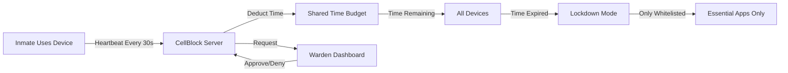

# Welcome to CellBlock

**CellBlock** is a cross-platform digital wellbeing app designed for high-accountability usage. Unlike standard screen time blockers, CellBlock implements a "Default Deny" policy where internet access is blocked by default, with only specific exceptions allowed.

## What Makes CellBlock Different?

### Default Deny Policy
Most screen time apps work by blocking specific apps or websites. CellBlock flips this model - **everything is blocked by default**, and you choose what to allow. This ensures you stay focused on what truly matters.

### Cross-Device Time Budget
Your time budget is shared across all your devices. If you use 30 minutes on your iPhone, you have 30 minutes less on your Windows PC. No more device-hopping to bypass limits.

### Warden Enforcement
CellBlock isn't just another app you can disable when tempted. A trusted friend or family member (your "Warden") holds the keys to changing settings or granting emergency access. This creates real accountability.

## Key Features

### For Users (Inmates)

- **Time Budget Synchronization** - One budget shared across iOS, Windows, and more
- **Smart Whitelist** - Allow essential apps like Maps, Banking, and Work Tools
- **Healthy Apps** - Optional access to less distracting content (Spotify, Audible, Podcasts)
- **Usage Analytics** - Understand your screen time patterns
- **Emergency Access** - Break glass feature when you need to end supervision
- **Time Warnings** - 15-minute and 5-minute alerts before lockdown

### For Wardens

- **Unified Dashboard** - Manage all your inmates from one place
- **Request Approval** - Review and approve whitelist and time budget changes
- **Emergency Powers** - Grant parole (extra time) or trigger lockdowns
- **Usage Reports** - View trends and help inmates stay on track
- **Real-Time Status** - See when inmates are active or locked out
- **Comments** - Communicate through request approval system

## How It Works

1. **Setup** - Create account, set your time budget, invite a warden
2. **Daily Use** - Use your devices normally within your time budget
3. **Tracking** - CellBlock tracks usage across all devices in real-time
4. **Lockdown** - When time expires, only whitelisted apps remain accessible
5. **Requests** - Need more time or a new app? Request warden approval

## Supported Platforms

| Platform | Status | Blocking Method |
|----------|--------|-----------------|
| iOS 16+ | Available | Screen Time API |
| Windows 10/11 | Available | Network Filtering |
| Android | Coming Soon | Digital Wellbeing API |
| macOS | Coming Soon | Network Filtering |

## Core Principles

### Whitelist-First
Block everything by default. Only allow essentials like Maps, Calculator, and Banking apps. This prevents mindless browsing while keeping utility intact.

### Shared Budget
Time usage synchronizes across all devices. 60 minutes on iOS reduces your Windows time by 60 minutes. No loopholes.

### Friend Enforcement
Your warden (a trusted friend or family member) approves changes to your settings. This creates external accountability that's hard to bypass.

### Privacy-Preserving
CellBlock tracks time usage, not content. Your warden sees how much time you use, not which specific websites you visit.

## Getting Started

Ready to take control of your digital wellbeing? Here's where to begin:

-   :material-clock-fast:{ .lg .middle } __Quick Start__

    ---

    Install CellBlock, set up your account, and configure your first time budget

    [:octicons-arrow-right-24: Get Started](user-guide/getting-started.md)

-   :material-account-lock:{ .lg .middle } __Inmate Guide__

    ---

    Learn how to use CellBlock effectively, manage your whitelist, and work with your warden

    [:octicons-arrow-right-24: Inmate Guide](user-guide/inmate-guide.md)

-   :material-shield-account:{ .lg .middle } __Warden Guide__

    ---

    Understand your role as a warden and how to help inmates stay accountable

    [:octicons-arrow-right-24: Warden Guide](user-guide/warden-guide.md)

-   :material-frequently-asked-questions:{ .lg .middle } __FAQ__

    ---

    Common questions and answers about CellBlock features and behavior

    [:octicons-arrow-right-24: FAQ](user-guide/faq.md)

## Open Source

CellBlock is open source software licensed under MIT. Contributions are welcome!

- **Repository**: [github.com/dirkpetersen/cellblock](https://github.com/dirkpetersen/cellblock)
- **Issues**: [Report bugs or request features](https://github.com/dirkpetersen/cellblock/issues)
- **Discussions**: [Community discussions](https://github.com/dirkpetersen/cellblock/discussions)

## Tech Stack

Built with modern, robust technologies:

- **Backend**: NestJS (TypeScript) + PostgreSQL + Prisma
- **Frontend**: Next.js 14 + TailwindCSS + TanStack Query
- **iOS**: Swift + SwiftUI + Screen Time API
- **Windows**: C# .NET 8 + WPF/WinUI
- **Real-time**: WebSockets (Socket.io)

---

!!! info "Documentation Status"
    This documentation is continuously updated as features are developed. Last updated: {{ git_revision_date_localized }}

!!! question "Need Help?"
    - Check the [FAQ](user-guide/faq.md) for common questions
    - Browse [GitHub Discussions](https://github.com/dirkpetersen/cellblock/discussions) for community support
    - Report issues on [GitHub Issues](https://github.com/dirkpetersen/cellblock/issues)
